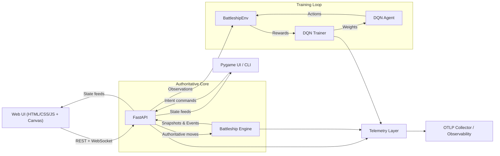
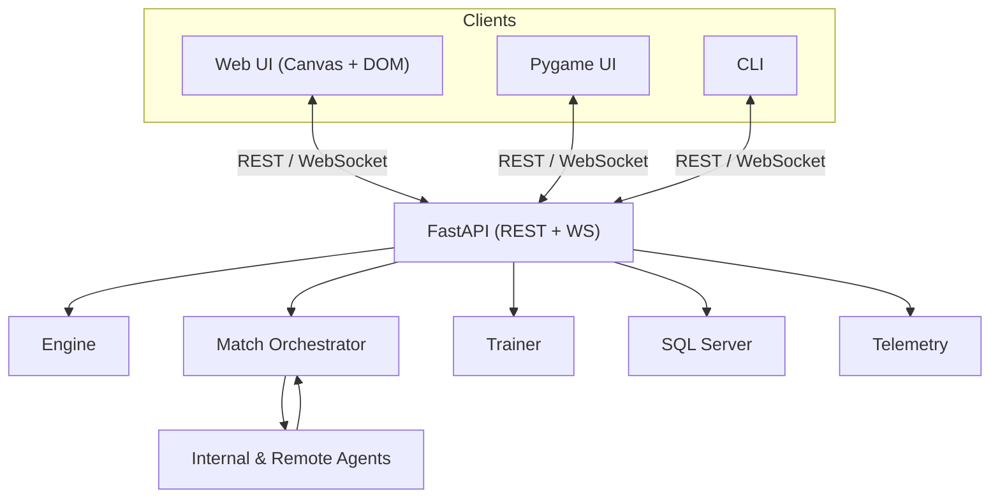
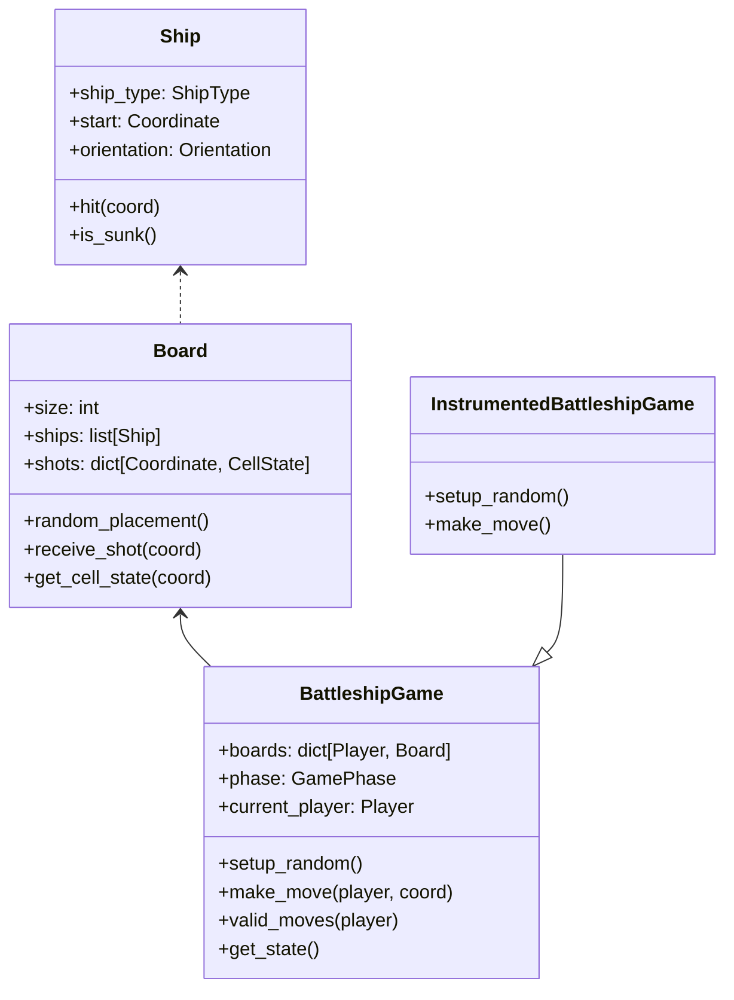
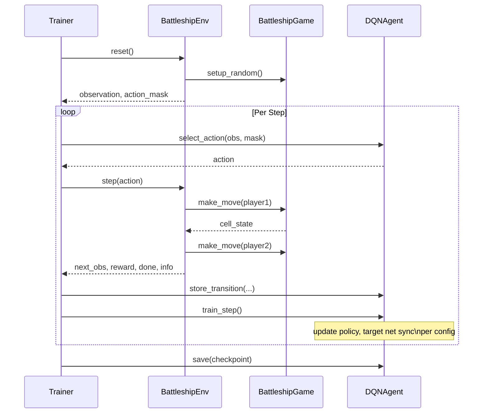
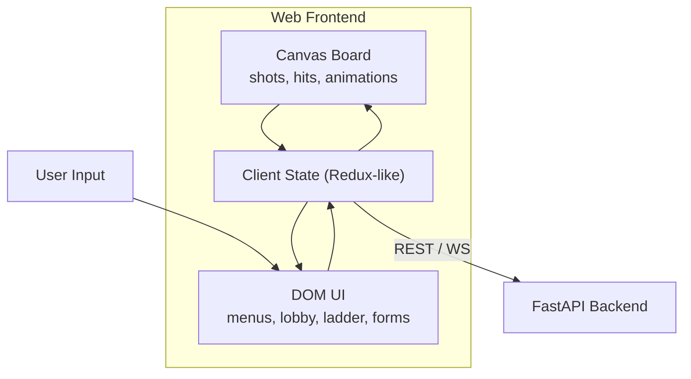

# Battleship-RL Architecture

This document describes the major components of the Battleship reinforcement
learning project and how they interact across engine logic, AI training, UI
layers, and telemetry. Diagrams use Mermaid syntax so they render in GitHub.

---

## 1. High-Level System Overview



- **Engine**: deterministic ship placement, turn order, rule enforcement. All canonical game state lives server-side.
- **Clients**: browser-based Canvas UI (primary), plus legacy Pygame/CLI. Every client only sends high-level intents (fire at coordinate, join room) and receives snapshots/events from the backend.
- **FastAPI backend**: exposes REST + WebSocket APIs, orchestrates matches, invokes agents (local or remote), and mediates access to the engine, Gymnasium environment, and trainer.
- **Gymnasium Env & Trainer**: unchanged RL bridge powering training jobs and AI-vs-AI simulations.
- **Telemetry**: shared instrumentation for tracing, metrics, logging across backend, engine, trainer, and clients.

### Web + Service View



---

## 2. Engine & Telemetry Modules



- `Board`, `Ship`, and `Coordinate` model the physical state of each player.
- `BattleshipGame` enforces phases, turn order, and win detection.
- `InstrumentedBattleshipGame` wraps `setup_random` and `make_move` with OTEL spans
  and emits metrics/logs for hits, misses, and wins.

---

## 3. RL Agent & Training Loop



- `BattleshipEnv` acts as the bridge between RL code and the deterministic engine.
- `Trainer` manages episodes, epsilon decay, evaluation runs, and checkpointing.
- `DQNAgent` provides the dueling CNN architecture, replay buffer, and target updates.
- `InstrumentedDQNAgent` (opt-in) surrounds `select_action`/`train_step` with spans & metrics.

---

## 4. UI Stack



- **Web UI (primary)**: Entirely written in JavaScript/TypeScript with HTML/CSS. The Battle board renders on `<canvas>` (for grid, ship silhouettes, particle effects), while menus, lobby, ladder, replay viewer, and training forms live in the DOM.
  - **REST calls**: create rooms, configure matches, submit moves, schedule AI-vs-AI matches, manage agents, start training jobs.
  - **WebSockets**: subscribe to lobby streams and per-match channels for low-latency updates without polling (room list, players joining/leaving, shots, game-over events).
  - **Modes** (human vs AI / human vs human) share the exact same API surface; the backend enforces mode-specific rules.
- **Pygame UI & CLI (secondary)**: continue to exist as alternative clients using the same REST/WS APIs. They remain useful for local development or simplified interfaces, but the long-term UX centers on the web frontend.
- Regardless of client, game logic never runs locally—clients submit “fire at (row, col)” intents and render whatever the server returns.

---

## 5. Backend Architecture (FastAPI/API Layer)

- **FastAPI** is the authoritative gateway: it terminates REST and WebSocket traffic, authenticates users, brokers access to SQL Server, and invokes the engine, Gymnasium environment, DQN trainer, or remote agents as needed.
- **REST endpoints** cover:
  - Authenticated operations (`/api/me`, user profile).
  - Lobby & rooms (list/create/join/leave).
  - Match management (create, status, submitting moves).
  - AI-vs-AI scheduling, ladder, agent registry, and training jobs/summaries.
- **WebSocket endpoints** deliver:
  - Lobby real-time events (`/ws/lobby`).
  - Live match feeds (`/ws/matches/{match_id}`) for human-vs-human or spectators.
- **Match orchestrator** (service running inside FastAPI workers or background tasks):
  - Drives AI-vs-AI battles by repeatedly building player observations, requesting actions (internal DQN or remote HTTP agents), applying them via the engine, and recording replays.
  - Emits telemetry for each decision and final ratings.
- **Integration points**:
  - Engine: FastAPI instantiates `BattleshipGame`/`InstrumentedBattleshipGame` per match and keeps canonical state.
  - Gymnasium + Trainer: exposed via API so users can start/monitor training jobs.
  - Telemetry: every API call, orchestrated move, and training step is wrapped in OTEL spans with metrics/logs forwarded to the collector.

---

## 6. Telemetry Wiring

```mermaid
flowchart LR
    subgraph Modules
        EngineTracing["InstrumentedBattleshipGame"]
        AgentTracing["InstrumentedDQNAgent"]
        UITracing["BattleshipUI Telemetry"]
    end

    EngineTracing --> Tracer["get_tracer('battleship.engine')"]
    AgentTracing --> Tracer
    UITracing --> Tracer

    EngineTracing --> Meter["get_meter('battleship.engine')"]
    AgentTracing --> Meter
    UITracing --> Meter

    EngineTracing --> Logger["get_logger('battleship.engine')"]
    AgentTracing --> Logger
    UITracing --> Logger

    Tracer --> OTLP["OTLP Trace Exporter / Console"]
    Meter --> OTLP
    Logger --> OTLP Logs
```

- `battleship.telemetry.tracer` / `metrics` / `logger` expose singletons.
- Telemetry initialization (`init_telemetry` or individual `init_*` functions) configures OTLP exporters or console fallbacks.
- Each module passes consistent attributes (e.g., player, coord, frame index) to keep observability correlated across engine, agent, and UI.
- Web backend and web UI add identifiers (match_id, room_id, agent_id, user_id) so traces, metrics (move latency, win rates, training KPIs), and logs can be correlated with SQL Server entities, and deep-linked from the UI into observability dashboards.
- Replays are stored in SQL Server (move transcripts) and can be replayed via Canvas animations; corresponding telemetry spans let engineers inspect latency or errors alongside the replay.

---

## 7. Data Storage (SQL Server)

SQL Server is the authoritative relational store for structured data powering the web UI:

- **Users**: internal `user_id`, linked Auth0 provider/sub, display name, avatar, preferences.
- **Rooms & RoomPlayers**: lobby metadata (owner, mode, capacity, status) and the players currently in a room.
- **Matches**: mode (human_vs_ai, human_vs_human, ai_vs_ai), participants, assigned agents, RNG seeds, start/end timestamps, victory reason.
- **MatchMoves**: ordered move list (row/col, player, outcome, elapsed time) used for replays and analytics.
- **Agents**: both internal Python agents and remote agents (type, callback URL, owner, description).
- **AgentRatings**: per-agent ELO/TrueSkill-style ratings, win/loss/draw counts, historical snapshots.
- **TrainingJobs & TrainingRunSummary**: job configs, status, metrics (reward curves, win rates), and references to produced checkpoints (paths/object-storage IDs).

Notes:
- Model checkpoints themselves live outside SQL Server (filesystem, blob storage, or artifact store) and are referenced by ID/path.
- OpenTelemetry traces/metrics/logs remain in the observability stack; SQL Server only stores IDs to cross-link.

---

## 8. Authentication (Auth0 + JWT)

- **Identity Provider**: Auth0 handles sign-up/login via a hosted login page or Auth0 JS SDK.
- **Frontend flow**:
  1. User authenticates with Auth0.
  2. The browser receives an ID token (JWT) and access token.
  3. All REST and WebSocket requests include `Authorization: Bearer <JWT>`.
- **Backend responsibilities** (FastAPI middleware):
  - Validate JWT signature using Auth0 JWKS, issuer (`iss`), audience (`aud`), and expiry (`exp`).
  - Map `(auth_provider, sub)` to an internal `user_id` stored in SQL Server (creating a row on first login).
  - Attach the `user_id` to request context so handlers enforce authorization.
- Protected endpoints (rooms, matches, agents, training jobs) reject requests without a valid token; public endpoints (e.g., ladder view) can allow anonymous access.

---

## 9. Game Modes & Orchestration

1. **Human vs AI**
   - Player connects via web UI (primary) or Pygame/CLI.
   - Backend creates a match with the chosen agent (internal DQN, instrumented agent, or registered remote agent).
   - Client submits moves via REST (`POST /api/matches/{id}/move`) while receiving state snapshots/events via WebSocket.
   - Server enforces legality, applies moves to the engine, and broadcasts updates.

2. **Human vs Human (networked)**
   - Lobby exposes rooms (room_id, status, owner). Players create/join via REST; lobby WebSocket publishes updates.
   - When a room is “ready”, FastAPI spins up a match, subscribes both players (and optional spectators) to `/ws/matches/{id}`, and manages turn order.
   - Backend validates every move, persists it to SQL Server, and notifies all participants.

3. **AI vs AI**
   - Match orchestrator launches matches between two agents (internal or remote).
   - Loop: build observation → request action → validate/apply via engine → record telemetry.
   - On completion, orchestrator stores the replay (MatchMoves), updates AgentRatings, and publishes ladder updates.

---

## 10. Remote Agents

- Agents are registered via `/api/agents` with `agent_id`, name, type (`internal`, `remote`), optional callback URL, and metadata.
- **Remote agent protocol**:
  - For each turn, backend POSTs to the agent’s callback URL with JSON: `{ match_id, player_role, turn_index, observation, legal_actions }`.
  - Observation contains board tensors, last move summaries, and any additional features agreed upon.
  - Agent responds with `{ action: { row, col }, metadata? }`.
  - Backend validates legality/timeouts; illegal actions trigger retries, default moves, or forfeits per policy.
- Remote agents extend the RL architecture by allowing external services (written in any language) to participate in ladder matches or human-vs-AI games, while internal agents continue to rely on the Gymnasium/DQN stack.

---

## 11. Ladder & Stats

- After every AI-vs-AI match (or optionally human-vs-AI), the backend updates AgentRatings using an ELO/TrueSkill-style system stored in SQL Server.
- **Ladder view** (web UI):
  - Fetches `/api/ladder`, listing agents with rating, wins/losses/draws, streaks, and references to the latest matches.
  - Links to `/api/agents/{agent_id}` for detailed stats, replay list, training history, and configuration.
- Ratings and stats drive matchmaking (e.g., pairing similar-strength agents) and provide transparency for users evaluating models.

---

## 12. Replays & Observability

- **Replays**:
  - Every move (row, col, result, timestamp) persists to SQL Server (`MatchMoves`).
  - Web UI fetches `/api/ai-matches/{match_id}/replay` (or equivalent human match endpoint) and plays it on Canvas, replicating hits/misses with animations.
  - Pygame/CLI can request the same data for textual playback.
- **Observability**:
  - OTEL spans wrap match lifecycle, agent decision requests (internal & remote), training jobs, and UI interactions (via OTEL JS SDK).
  - Metrics track move latency per agent, win/loss rates per mode, queue depth for orchestrator, training KPIs.
  - Logs capture validation errors, remote agent timeouts, matchmaking decisions.
  - SQL Server stores trace IDs alongside matches/training jobs so the UI can deep-link to dashboards (e.g., “View Trace” button opening Grafana/Tempo).

---

## 13. Test & Tooling Layout

---

## 6. Test & Tooling Layout

- `tests/ai/*`: covers DQN tensor shapes, replay buffer, epsilon-greedy logic.
- `tests/telemetry/*`: ensures spans/metrics/loggers initialize lazily and instrumentation hooks fire.
- GitHub Actions workflow (`.github/workflows/ci.yml`) runs lint → type-check → pytest (with `SDL_VIDEODRIVER=dummy`, coverage upload to Codecov) across Python 3.10/3.11.
- `requirements-dev.txt` pins developer tools (ruff, black, mypy, pytest, pygame, gymnasium, fastapi, uvicorn, numpy<2).
- Future web-specific tooling (front-end lint/tests) will integrate into the same pipeline once the web UI repo is merged.

---

## 14. API Surface (REST + WebSocket)

**Authentication / Identity**
- All protected endpoints expect `Authorization: Bearer <JWT>` (Auth0-issued).
- `GET /api/me` returns the authenticated user’s profile + internal `user_id`.

**Users**
- `GET /api/users/{user_id}` (or `/api/me`) returns display name, avatar, linked agents. Used for profile pages and attribution (e.g., room owners).

**Lobby**
- `GET /api/lobby/rooms` – list open rooms with filters (mode, capacity).
- `POST /api/lobby/rooms` – create a room (requires auth).
- `POST /api/lobby/rooms/{room_id}/join` – join an existing room.
- `POST /api/lobby/rooms/{room_id}/leave` – leave a room.
- `WebSocket /ws/lobby` – push room created/updated/deleted events, player join/leave notifications so the lobby UI stays live without polling.

**Matches (human-involved)**
- `POST /api/matches` – create a match (`mode`, opponent/agent IDs, settings).
- `GET /api/matches/{match_id}` – fetch current state (boards, turn, history summary).
- `POST /api/matches/{match_id}/move` – submit a move for the authenticated player.
- `WebSocket /ws/matches/{match_id}` – stream real-time events (state snapshots, move outcomes, chat, game-over).

**AI vs AI Matches**
- `POST /api/ai-matches` – schedule an AI vs AI match (two agent IDs, optional seeds/config).
- `GET /api/ai-matches/{match_id}` – status/progress.
- `GET /api/ai-matches/{match_id}/replay` – complete move transcript for replay viewers.

**Agents & Ladder**
- `POST /api/agents` – register a new agent (internal metadata or remote callback URL).
- `GET /api/agents` – list agents (filter by owner/type).
- `GET /api/agents/{agent_id}` – detailed info (type, callback, rating, stats, training runs).
- `GET /api/ladder` – aggregated ranking for the ladder view.

**Training**
- `POST /api/training-jobs` – start a training job (hyperparameters, env config, target agent).
- `GET /api/training-jobs` – list jobs (optionally filtered by user).
- `GET /api/training-jobs/{job_id}` – job details, metrics, checkpoint references.

These endpoints power the browser UI (rooms, matches, ladder, training console) and are also used by alternative clients. WebSockets ensure responsive lobby/match experiences; REST handles idempotent operations and administrative tasks.

---

## 15. Roadmap Hooks

- **API Layer** (`battleship.api.server`): now the core FastAPI service described above; additional background workers (Celery, Dramatiq) can be added for heavy training/match orchestration.
- **Web UI Goal**: `WEB_UI_README.md` captures the multi-step plan for the browser client, replay tooling, and observability integration; this document now reflects those target architectures.
- Future work includes Kubernetes manifests, remote agent SDKs, and extended telemetry dashboards.

This architecture keeps core game logic deterministic on the backend, enables multiple clients (browser, Pygame, CLI), supports RL experimentation, and lays the groundwork for a fully observable, competitive Battleship platform with ranked agents and human participation.
