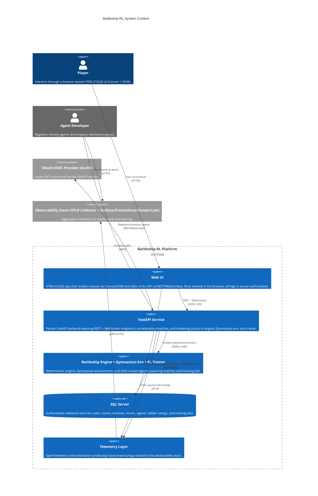
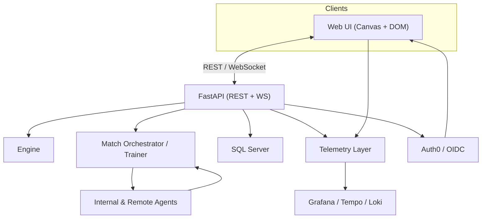
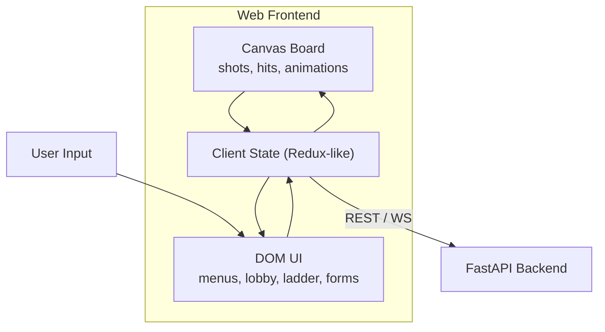
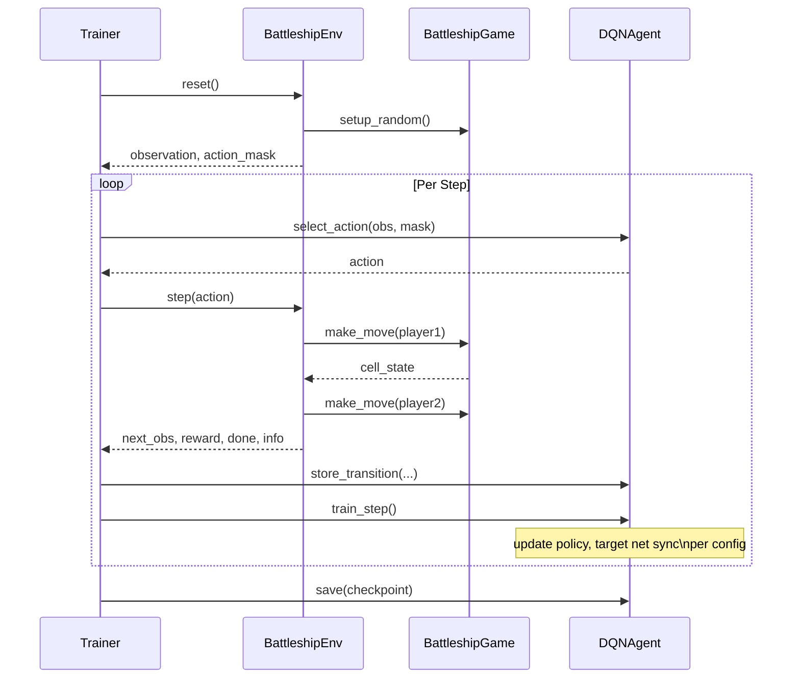
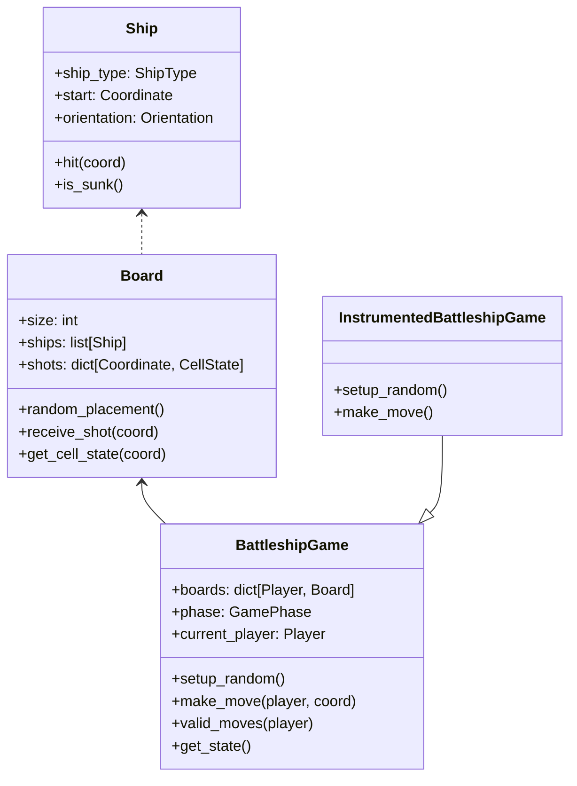
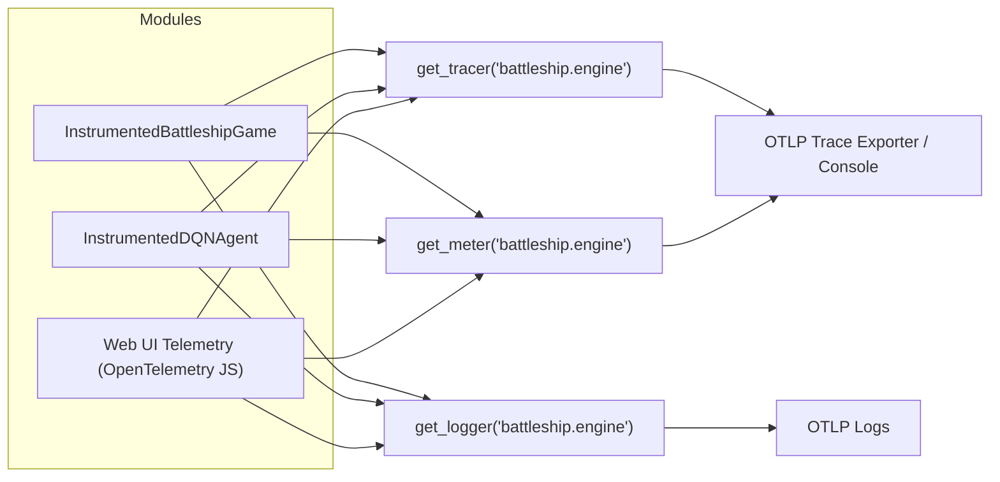

# Battleship RL – Architecture

## 0. Document Overview

- **Purpose**: Describe how Battleship-RL is assembled across UI, backend, RL, data, and telemetry layers so contributors can reason from system context down to code.
- **Audience**: Engineers building the web UI, Python backend, Gymnasium environment, RL agents, and observability tooling; stakeholders reviewing the platform architecture.
- **Scope**: Covers the single browser client, FastAPI service, deterministic engine with Gymnasium + DQN trainer, SQL Server storage, telemetry/observability stack, authentication, remote agents, and supporting tooling.

---

## 1. System Context

### 1.1 System Summary

Battleship-RL keeps deterministic game logic on the server while exposing REST/WebSocket APIs to a browser-only HTML/CSS/JS client. A Gymnasium environment and DQN trainer power AI agents and training jobs, with SQL Server as the authoritative store for users, rooms, matches, moves, agents, ratings, and training metadata. OpenTelemetry instrumentation spans the engine, backend, trainer, and web UI, exporting to an enterprise-grade observability stack. Auth0 (OAuth/OIDC) issues JWTs enforced by FastAPI middleware.

### 1.2 External Users & Systems

- **Players** interact exclusively via the browser-based Canvas/DOM UI.
- **Agent Developers** register remote agents, schedule matches, and inspect telemetry/replays.
- **OAuth/OIDC provider (Auth0)** authenticates users and issues JWTs.
- **Observability stack (OTLP collector + Grafana/Prometheus/Tempo/Loki)** stores traces/metrics/logs.
- **Remote Agents** (external services) participate in matches through a callback protocol.

### 1.3 Context Diagram

---

## 2. Containers (High-Level Structure)

### 2.1 Container List

- **Web UI (HTML/CSS/JS + Canvas/DOM)**: Sole player-facing client submitting intents via REST/WebSockets and rendering server state.
- **FastAPI Service**: Authoritative gateway handling auth, lobby, rooms, matches, AI orchestration, telemetry hooks, and SQL access.
- **Match Orchestrator & RL Trainer (Gymnasium + DQN)**: Runs AI-vs-AI matches, training jobs, and interacts with `BattleshipEnv`.
- **Deterministic Battleship Engine**: Enforces ship placement, turn order, win detection, and instrumentation hooks.
- **SQL Server**: Stores users, rooms, matches, moves, agents, ratings, training jobs, and replay transcripts.
- **Telemetry Layer / Observability Stack**: OpenTelemetry SDKs (Python + JS) streaming telemetry through OTLP collectors to Grafana/Prometheus/Tempo/Loki.
- **OAuth/OIDC Authentication**: Auth0 issuing JWTs validated by FastAPI.
- **Remote Agent Ecosystem**: External services registered via API to supply actions in orchestrated battles.

### 2.2 Container Relationships Diagram

This view keeps client traffic, backend calls, telemetry exports, and authentication flows in one place so readers can quickly see the end-to-end dependencies.

### 2.3 Web UI (HTML/CSS/JS + Canvas/DOM)

#### 2.3.1 Purpose
Provide the single supported client experience for players, including lobby, ladder, matches, replays, and training controls.

#### 2.3.2 Responsibilities
- Render boards via `<canvas>` and DOM views for menus, lobby, ladder, replay viewer, and training forms.
- Issue REST calls to configure rooms, matches, agents, and training jobs.
- Maintain WebSocket subscriptions for lobby/match feeds with low latency.
- Offer identical workflows for human-vs-human and human-vs-AI modes using shared APIs.

#### 2.3.3 Interfaces (In/Out)
- **Outbound**: REST (`/api/*`) for CRUD operations; WebSocket (`/ws/lobby`, `/ws/matches/{id}`) for streaming updates; telemetry via OTEL JS SDK.
- **Inbound**: Receives state snapshots/events, lobby updates, and telemetry backends for dashboards.

#### 2.3.4 Dependencies
- FastAPI endpoints, Auth0 JS SDK for authentication flows, OTEL JS SDK for telemetry metadata.

### 2.4 FastAPI Service (Backend/API Layer)

#### 2.4.1 Purpose
Act as the authoritative gateway terminating REST/WebSocket traffic, authenticating users, orchestrating matches/training, mediating engine access, and persisting to SQL Server.

#### 2.4.2 Responsibilities
- Expose REST endpoints for auth, lobby, matches, AI scheduling, ladder, agents, and training jobs.
- Provide WebSocket endpoints for lobby and per-match events.
- Run match orchestrator loops managing human/AI turns and validating moves.
- Trigger Gymnasium/DQN training jobs and monitor their progress.
- Wrap API calls, orchestrated moves, and training steps with telemetry spans/metrics/logs.

#### 2.4.3 Interfaces (In/Out)
- **Inbound**: Browser REST/WS calls authenticated via JWT; remote agent callbacks; telemetry configuration via environment.
- **Outbound**: Calls into engine modules, Gymnasium env, DQN trainer, SQL Server, OTEL exporters, remote agents.

#### 2.4.4 Dependencies
- Deterministic Battleship engine library, Gymnasium `BattleshipEnv`, DQN trainer/agents, SQL Server drivers, Auth0 JWKS for token validation, telemetry exporters.

### 2.5 Match Orchestrator & RL Trainer

#### 2.5.1 Purpose
Simulate AI-vs-AI matches, execute RL training loops, and provide reusable agents that FastAPI can invoke.

#### 2.5.2 Responsibilities
- Drive Gymnasium environment episodes (`reset`, `step`) and coordinate DQN agent actions.
- Manage epsilon decay, evaluation runs, checkpointing, and replay buffers.
- Execute orchestrated AI battles, post results to SQL Server, update agent ratings, and publish ladder updates.

#### 2.5.3 Interfaces (In/Out)
- **Inbound**: Scheduling commands from FastAPI (start training job, run AI match).
- **Outbound**: Engine operations (`make_move`, `setup_random`), telemetry emissions, SQL persistence, remote agent callbacks for external participants.

#### 2.5.4 Dependencies
- `BattleshipEnv`, `DQNTrainer`, `DQNAgent`, telemetry singletons, SQL Server.
- **Long-running training jobs**: launched via FastAPI tasks or worker pods using `battleship.ai.training.main`. Jobs stream metrics to SQL/telemetry, checkpoint models to `training_artifacts/`, and publish job status back to the API for UI monitoring.
- **Ad-hoc match orchestration**: lightweight loops executed inline with FastAPI workers (for human-vs-human and human-vs-AI) or via dedicated worker processes for AI-vs-AI tournaments. These flows prioritize deterministic sequencing, per-move telemetry, and immediate persistence of move transcripts.

### 2.6 Deterministic Battleship Engine

#### 2.6.1 Purpose
Maintain canonical game state, enforce rules, and provide instrumented operations for telemetry correlation.

#### 2.6.2 Responsibilities
- Manage boards, ships, turn order, move validation, and victory detection.
- Offer instrumented versions of `setup_random` and `make_move` to emit spans/metrics/logs.

#### 2.6.3 Interfaces (In/Out)
- **Inbound**: Invocations from FastAPI or Gymnasium env.
- **Outbound**: State snapshots for clients, telemetry data, move outcomes for storage.

#### 2.6.4 Dependencies
- Data classes (`Board`, `Ship`, `BattleshipGame`) and telemetry helpers.

### 2.7 SQL Server (Authoritative Data Store)

#### 2.7.1 Purpose
Serve as the system of record backing the web UI, agents, training jobs, and analytics.

#### 2.7.2 Responsibilities
- Store users, rooms, matches, move transcripts, agents, ratings, training jobs, and replay references.
- Provide durable audit/history needed for ladder rankings and observability cross-links.

#### 2.7.3 Interfaces (In/Out)
- **Inbound**: CRUD operations from FastAPI (via ODBC/pytds or equivalent).
- **Outbound**: Query responses feeding UI/API responses and replay downloads.

#### 2.7.4 Dependencies
- SQL Server instances/driver connectivity, migrations/schema definition.

### 2.8 Telemetry Layer / Observability Stack

#### 2.8.1 Purpose
Deliver enterprise-grade observability across backend, engine, trainer, and web UI components.

#### 2.8.2 Responsibilities
- Provide OTEL tracer/meter/logger singletons for Python modules.
- Collect browser telemetry via OTEL JS SDK (page views, API calls, WebSocket events).
- Ship telemetry to OTLP collectors, Grafana/Prometheus/Tempo/Loki dashboards, and correlate IDs with SQL entities.

#### 2.8.3 Interfaces (In/Out)
- **Inbound**: Instrumented spans/metrics/logs from engine, API, trainer, and web UI.
- **Outbound**: Export streams to OTLP collector, dashboards, and alerts.

#### 2.8.4 Dependencies
- OpenTelemetry SDKs (Python + JS), collector endpoints, Grafana stack integrations.

### 2.9 OAuth/OIDC Authentication

#### 2.9.1 Purpose
Authenticate players and agents via Auth0, issuing JWTs enforced by FastAPI middleware.

#### 2.9.2 Responsibilities
- Handle login/signup flows, provide tokens with claims for FastAPI, and expose JWKS for validation.

#### 2.9.3 Interfaces (In/Out)
- **Inbound**: Players using Auth0 hosted login or JS SDK flows.
- **Outbound**: JWTs consumed by browser, FastAPI verification, user profile lookups.

#### 2.9.4 Dependencies
- Auth0 tenant configuration, FastAPI security middleware, SQL user mapping.

### 2.10 Remote Agent Ecosystem

#### 2.10.1 Purpose
Let external services participate in matches and training evaluations through a stable protocol.

#### 2.10.2 Responsibilities
- Maintain agent registry metadata (type, callback URL, owner, ratings).
- For each turn, send observations to remote callbacks and ingest returned moves.

#### 2.10.3 Interfaces (In/Out)
- **Outbound**: HTTP POST callbacks with `{match_id, player_role, observation, legal_actions}`.
- **Inbound**: Action responses `{ action: { row, col }, metadata? }`, telemetry/reporting updates.

#### 2.10.4 Dependencies
- FastAPI agent endpoints, SQL Server storage, network connectivity to remote services.

---

## 3. Components (Per Container)

### 3.1 Components of Web UI

#### 3.1.1 Canvas Board
- Implements board rendering, ship silhouettes, and particle effects for hits/misses.

#### 3.1.2 DOM UI & State Store
- DOM handles menus, lobby, ladder, replay viewers, and training forms.
- State store synchronizes REST/WS payloads with UI, ensuring consistent match/lobby state.

### 3.2 Components of FastAPI Service

#### 3.2.1 REST Endpoints
- Auth (`/api/me`), lobby (`/api/lobby/rooms` CRUD), matches (`/api/matches`, move submission), AI matches (`/api/ai-matches`), agents (`/api/agents`), ladder (`/api/ladder`), training jobs (`/api/training-jobs`).

#### 3.2.2 WebSocket Endpoints
- `/ws/lobby` for room events, `/ws/matches/{match_id}` for state snapshots, moves, chat, and spectator updates.

#### 3.2.3 Match Orchestrator
- Drives human-vs-human, human-vs-AI, and AI-vs-AI flows:
  1. Players connect via web UI; backend creates matches with chosen agents.
  2. Lobby announces room updates until ready; backend manages subscriptions and turn order.
  3. AI-vs-AI loop builds observations, requests actions (internal or remote), validates/apply moves, records telemetry, stores replays, updates ratings.

#### 3.2.4 Remote Agent Integration
- Registers agents via `/api/agents`, enforces timeouts, handles retries/defaults for illegal actions, and updates ladder stats.

#### 3.2.5 Training Job Management
- Exposes APIs to start/monitor training jobs, streaming summaries, metrics, and checkpoints to clients.

### 3.3 Components of Match Orchestrator & RL Trainer

- `BattleshipEnv` bridges RL code with deterministic engine state snapshots.
- `Trainer` manages episodes, epsilon decay, evaluation runs, and checkpointing.
- `DQNAgent` provides dueling CNN architecture, replay buffer, target updates; optional instrumentation wraps `select_action`/`train_step`.

### 3.4 Components of Deterministic Engine

### 3.5 Components of SQL Server

- **Users**: internal `user_id`, Auth0 link, display info.
- **Rooms & RoomPlayers**: lobby metadata (owner, mode, capacity, status) and occupants.
- **Matches**: participants, modes, seeds, timestamps, victory reasons.
- **MatchMoves**: ordered move list used for replays and analytics.
- **Agents**: metadata for internal/remote agents.
- **AgentRatings**: ELO/TrueSkill-like ladder data.
- **TrainingJobs & TrainingRunSummary**: configs, status, metrics, checkpoint references.
- Notes: model checkpoints live outside SQL Server (filesystem/blob store) referenced by ID/path; telemetry lives in observability stack but stores IDs for cross-linking.

### 3.6 Components of Telemetry Layer

- Python modules expose singleton tracer/meter/logger initializers.
- Web backend and engine/agent components emit spans/metrics via Python OTEL SDK.
- Browser UI emits OTEL JS telemetry (page views, API calls, WebSocket events).
- Shared identifiers (match_id, room_id, agent_id, user_id) keep traces correlated with SQL entities and enable UI deep links.
- Replays stored in SQL Server can be replayed via Canvas animations; telemetry spans line up with move latency/errors.

### 3.7 Components of OAuth/OIDC

- Hosted login page or Auth0 JS SDK flows providing ID/access tokens.
- FastAPI middleware validating JWT signature/claims (issuer, audience, expiry) and mapping `(provider, sub)` to internal `user_id`.
- Request context attaches `user_id` for downstream authorization.

### 3.8 Components of Remote Agent Ecosystem

- Agent registry storing metadata, callback URLs, owner info.
- Callback protocol exchanging observations and actions with timeout handling, retries, defaults for illegal moves, and telemetry logging.
- Ladder integration updating ratings and exposing stats for web UI.

---

## 4. Code Mapping (Per Container / Component)

### 4.1 Code for Web UI

- The browser SPA is being designed in the root-level `WEB_UI_README.md`, which tracks the React/TypeScript build plan, Canvas replay viewer, and WebSocket-driven lobby/match views.
- Until the SPA sources land in this repo, the UI contract is expressed through the FastAPI endpoints documented in §3.2 and the telemetry wiring in §3.6. All client-state/replay requirements are enumerated in `WEB_UI_README.md#3-Target-Web-UI-Overview`.
- Every interface described in this document (REST, WebSocket, telemetry, replays) assumes the browser-based client as the sole UI; there is no desktop fallback in the supported architecture.

### 4.2 Code for FastAPI Service

- **Core service**: `battleship.api.server` (FastAPI app wiring REST + WebSocket routes, middleware, dependencies).
- **Match orchestrator**: background tasks or worker modules driving matches/training (described under “Match Orchestrator” above).
- **Remote agents**: `/api/agents` routers managing registry, callback invocation, and ladder updates.
- **Testing**: `tests/ai/*` covers DQN logic, replay buffers, epsilon-greedy behavior; `tests/telemetry/*` ensures instrumentation wiring.

### 4.3 Code for Engine & Gymnasium Components

- **Engine**: `BattleshipGame`, `Board`, `Ship`, and `InstrumentedBattleshipGame` classes implementing deterministic behavior and telemetry hooks.
- **Gymnasium env**: `BattleshipEnv` bridging the engine with RL interfaces.
- **Trainer/Agent**: `DQNTrainer`, `DQNAgent`, and `InstrumentedDQNAgent` implementing dueling CNN architecture, replay buffer, target sync, telemetry instrumentation.

### 4.4 Code for SQL Server Schema

- Schema migrations and models capturing Users, Rooms, Matches, MatchMoves, Agents, AgentRatings, TrainingJobs, and Replay references.
- SQLAlchemy models plus Alembic migrations will live under `src/battleship/api/db/` (models) and `src/battleship/api/db/migrations/` (revision scripts) once the persistence layer lands; these paths are reserved in the repo structure plan so other modules can import them without circular dependencies.
- Until that code is merged, schema drafts are maintained in §3.5 of this document and reflected in the FastAPI OpenAPI definitions for endpoints that will eventually read/write SQL Server.

### 4.5 Code for Telemetry & Observability

- `battleship.telemetry.tracer` / `metrics` / `logger` modules expose initializer helpers.
- `init_telemetry` (and `init_*` variants) configure OTLP exporters or console fallbacks.
- Web UI telemetry wiring will leverage OpenTelemetry JS SDK (page views, API calls, WS events).

---

## 5. Cross-Cutting Concerns

### 5.1 Security & Auth

- Auth0 handles signup/login; browser receives JWTs and sends `Authorization: Bearer <JWT>` headers for REST/WebSocket upgrades.
- FastAPI middleware validates JWT signature via Auth0 JWKS, issuer, audience, and expiry; maps to internal SQL users and enforces authorization per endpoint.
- Protected endpoints (rooms, matches, agents, training jobs) require valid tokens; anonymous access limited to public ladder views.

### 5.2 Observability & Telemetry

- OTEL spans wrap API calls, match orchestration, remote agent decisions, training jobs, and UI interactions.
- Metrics capture move latency per agent, win/loss rates per mode, queue depth, and training KPIs.
- Logs record validation errors, timeouts, matchmaking decisions; SQL rows store trace IDs for deep links from UI (“View Trace” actions).

### 5.3 Performance & Scalability

- FastAPI scales horizontally via additional Uvicorn/Gunicorn workers or ASGI pods; WebSockets are sharded per room/match channel and leverage Redis (or similar) pub/sub once multi-instance support is needed.
- Match orchestrator throughput is tunable by running multiple worker processes/containers consuming a shared job queue so long-running AI battles do not block human games.
- SQL Server tables should carry indexes on `(room_id, status)`, `(match_id, turn_index)`, and `(agent_id, rating_updated_at)` to keep lobby, replays, and ladder queries responsive as data grows; cold analytics can offload to read replicas.
- Training and inference loops stay deterministic by constraining RNG seeds per match and by batching telemetry exports asynchronously so gameplay latency remains low.

### 5.4 Testing Strategy

- GitHub Actions workflow (`.github/workflows/ci.yml`) runs lint → type-check → pytest (coverage upload to Codecov) across Python 3.10/3.11, keeping graphical dependencies headless-safe.
- `requirements-dev.txt` pins developer tools (ruff, black, mypy, pytest, gymnasium, fastapi, uvicorn, numpy<2).
- Future web-specific lint/tests will integrate once the web UI codebase merges.

---

## 6. Deployment View

### 6.1 Runtime / Environment Overview

- **Local development**: engineers run FastAPI via `poetry run uvicorn battleship.api.server:app --reload` (once endpoints land) and execute training loops with `python -m battleship.ai.training` while pointing telemetry to the local OTLP collector. SQL Server can be a developer’s local container or a shared dev instance.
- **Continuous Integration**: GitHub Actions executes lint/type-check/pytest jobs (see §5.4) and uploads coverage; headless rendering is enforced via environment variables (e.g., `SDL_VIDEODRIVER=dummy`) so RL + UI tests run reliably.
- **Production/staging**: FastAPI pods and orchestrator workers run in Kubernetes (see §6.2 for manifests), backed by managed SQL Server and the OTEL collector stack defined under `ops/`.

### 6.2 Docker / Compose / K8s

- `Dockerfile.trainer` builds the Gymnasium/DQN training container with OTEL exporters baked in; `docker-compose.training.yml` wires that container to Grafana Alloy (OTLP collector), Prometheus, and Grafana for local observability experiments.
- The `ops/` directory contains ready-to-use configs for Alloy (`ops/alloy/config.river`), Prometheus, Grafana dashboards, Loki, and Tempo—these are mounted by the compose stack or can be repurposed for Kubernetes ConfigMaps.
- Kubernetes deployment specs live under `k8s/` (pods/services placeholders) and will eventually host FastAPI, match workers, SQL proxies, and observability agents inside the same cluster.

### 6.3 Environments (dev/test/prod)

- **Dev**: Auth0 development tenant, SQL Server dev database, OTLP pointed at the local Alloy collector, and relaxed JWT audiences for rapid iteration. Feature flags default to enabling verbose telemetry and mock remote agents.
- **Test/CI**: Headless/test Auth0 credentials, ephemeral SQL Server (or containerized equivalent), OTLP endpoints referencing CI-friendly collectors; pipelines automatically seed test data and destroy resources afterward.
- **Prod**: Dedicated Auth0 tenant + JWKS, managed SQL Server with backups, OTLP routed to the enterprise Grafana stack, strict JWT scopes, and locked-down remote-agent registration requiring owner verification. Deployments roll out via blue/green or progressive delivery using Kubernetes tooling.

---

## 7. Roadmap / Future Work

- **API Layer** (`battleship.api.server`): Core FastAPI service described above; background workers (Celery, Dramatiq, etc.) may be introduced for heavy training/match orchestration.
- **Web UI Goal**: `WEB_UI_README.md` outlines the plan for the browser client, replay tooling, and observability integration; this document now mirrors that target architecture.
- Future enhancements include Kubernetes manifests, remote agent SDKs, extended telemetry dashboards, and richer replay/analysis tooling.

This architecture keeps core game logic deterministic on the backend, powers a single browser-based client, supports RL experimentation, and lays the groundwork for a fully observable, competitive Battleship platform with ranked agents and human participation.
